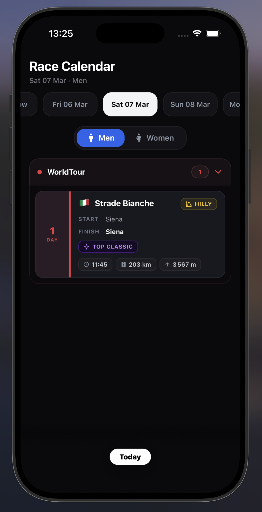
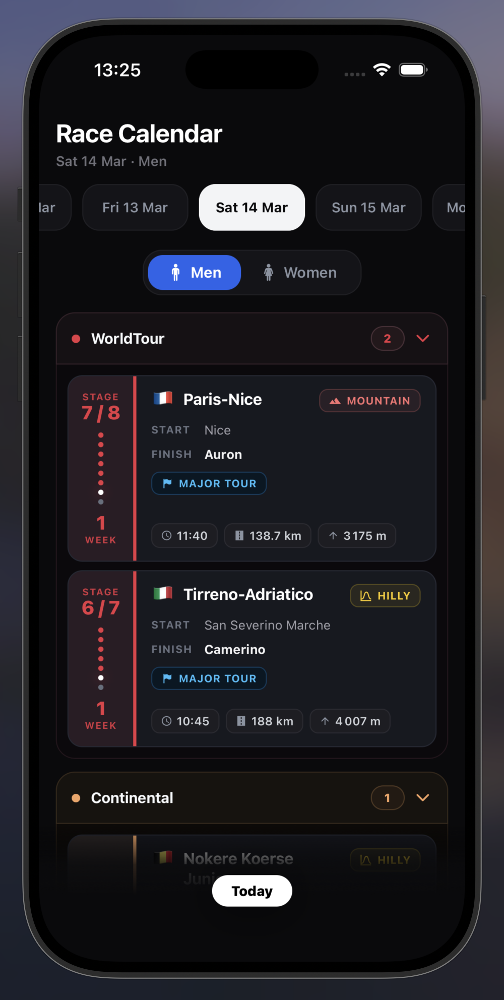
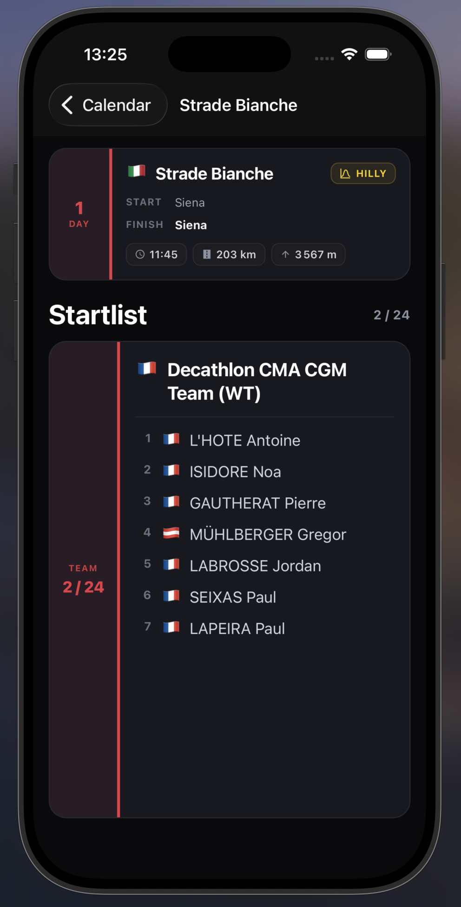

# Cycling Race Calendar App

A mobile application for tracking professional cycling races.

## Features

- View upcoming UCI races
- Filter races by gender (Men/Women)
- Mark races as favorites
- Dark mode UI

## Technology Stack

- React Native with Expo
- TypeScript
- React Navigation
- dayjs

## Setup Instructions

1. Clone the repository
2. Run `npm install`
3. Run `npm run fetch-races`
4. Run `npm start`

Do not launch the app with `npx expo start` directly. The npm scripts run a pre-check that ensures your local PCS data file exists first.

## Local Data Workflow

- PCS data is fetched only on your computer
- The scraper writes a local generated file used by the app
- That generated file is ignored by Git and never needs to be pushed
- `npm run fetch-races` uses a rolling 2-month window centered on today
- `npm run fetch-races-full` fetches the full season when you need a complete rebuild
- Startlists are refreshed for completed races plus upcoming races within the next 7 days; stage details are still fetched for all multi-day races in the selected window
- The scraper uses limited parallelism plus a local team-country cache at `scripts/.cache/team_country_cache.json`
- Re-run `npm run fetch-races` whenever you want fresher data, then reload the app

## Screenshots

